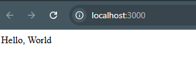
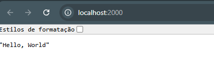

# Desafio 1 - Flask vs FastAPI

Este desafio contém dois pequenos servidores HTTP com apenas um endpoint `/` que retorna `Hello, World`.

---

## 🔧 Requisitos

Antes de rodar, certifique-se de ter o Python instalado:

```bash
python --version
# ou
python3 --version
```

Depois, instale o gerenciador de pacotes virtual `venv` (caso ainda não tenha):

```bash
# Linux/MacOS
sudo apt install python3-venv

# Windows
# Já vem instalado com Python >= 3.3
```

---

## ▶️ Como rodar os projetos

### ✅ 1. Rodar o projeto Flask

```bash
cd desafio_1/flask_app
python -m venv venv
source venv/bin/activate  # Windows: venv\Scripts\activate
pip install flask # ou pip install -r requirements.txt
# verifique se está na pasta correta desafio_1/flask_app
python app.py
```

Acesse no navegador: [http://localhost:3000](http://localhost:3000)

---

### ✅ 2. Rodar o projeto FastAPI

```bash
cd desafio_1/fasthttp_app
python -m venv venv
source venv/bin/activate  # Windows: venv\Scripts\activate
pip install fastapi uvicorn # ou pip install -r requirements.txt
# verifique se está na pasta correta desafio_1/flask_app
python app.py
```

Acesse no navegador: [http://localhost:2000](http://localhost:2000)


---


## 💡 Dúvidas Frequentes

### Posso rodar os dois servidores ao mesmo tempo?

Sim! Eles usam **portas diferentes** (`3000` para Flask e `2000` para FastAPI), então é possível rodar ambos em paralelo.

### Funciona no Windows, Linux, MacOS, Raspberry Pi?

Sim. Todos os sistemas operacionais que suportam Python 3.7+ podem rodar esses projetos com os mesmos comandos acima.

---

## 📊 Comparação técnica linha a linha

| Aspecto                    | Flask                                             | FastAPI                                        |
|---------------------------|---------------------------------------------------|------------------------------------------------|
| Importação do framework   | `from flask import Flask`                        | `from fastapi import FastAPI`                 |
| Criação da aplicação      | `app = Flask(__name__)`                          | `app = FastAPI()`                             |
| Definição da rota         | `@app.route("/", methods=["GET"])`              | `@app.get("/")`                               |
| Função que retorna a view | `def hello(): return "Hello, World"`             | `def hello(): return "Hello, World"`          |
| Execução do servidor      | `app.run(host="0.0.0.0", port=3000)`             | `uvicorn.run("app:app", host="0.0.0.0", port=2000)` |
| Servidor embutido         | Sim                                               | Não (usa Uvicorn)                             |
| Performance               | Média                                             | Alta                                          |
| Tipagem automática        | Não                                               | Sim (com Pydantic)                            |
| Criação de APIs modernas  | Básico                                            | Excelente (OpenAPI integrado)                 |

---

## ✅ Teste se funcionou

1. Rode `curl` ou use o navegador:

```bash
curl http://localhost:3000
# ou
curl http://localhost:2000
```

Ambos devem retornar:

```
Hello, World
```

2. Criar requisições no Postman para testar

🔹 Requisição para o servidor Flask ou FastAPI

Método: GET

URL: http://localhost:3000/  -> para o Flask

ou 

URL: http://localhost:2000/  -> para o FastAPI

Resposta esperada:
```
Hello, World
```
ℹ️ FastAPI retorna a string como JSON por padrão.


---